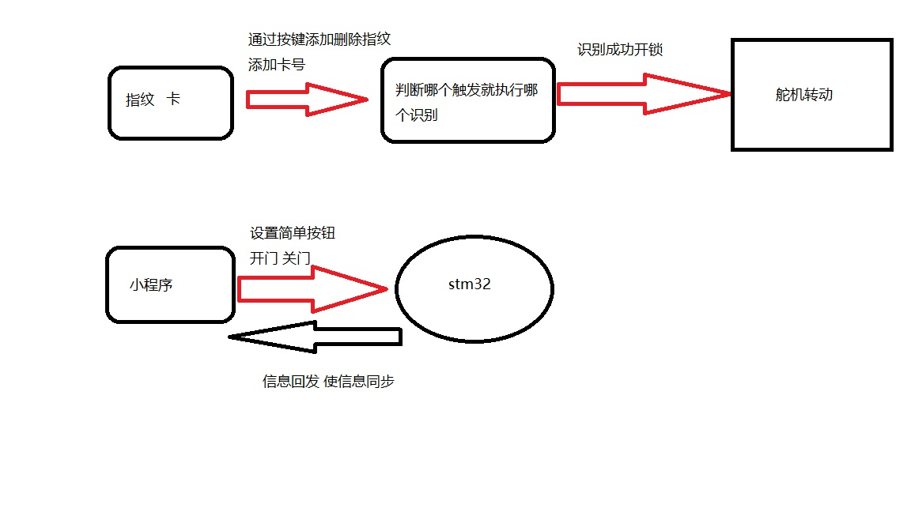
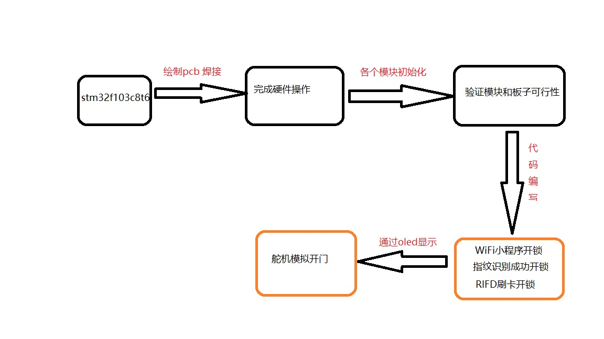
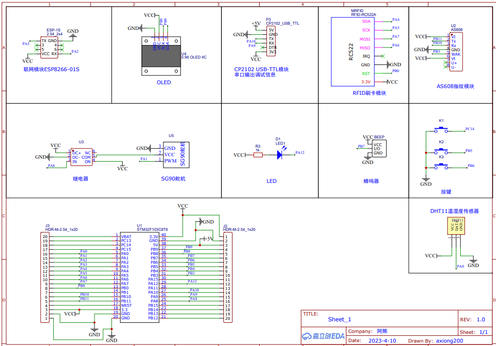
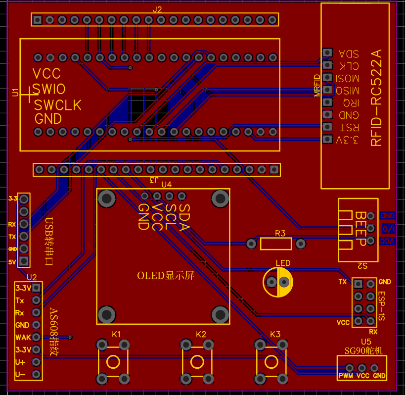
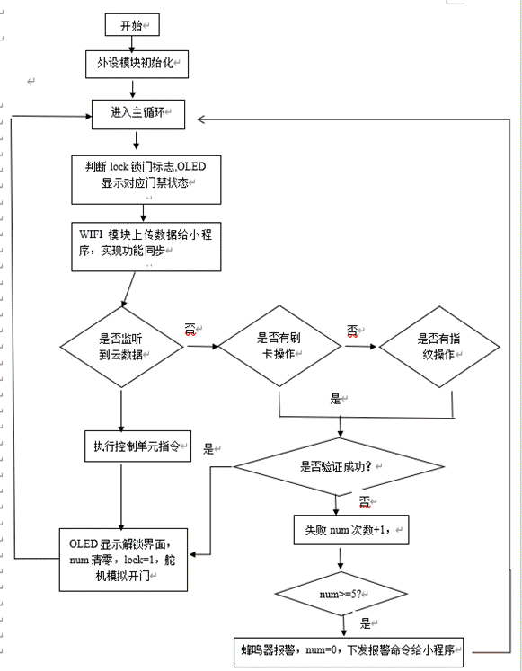
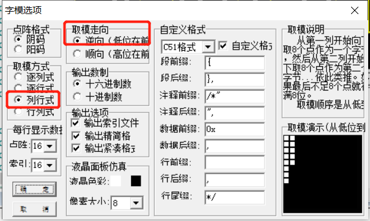
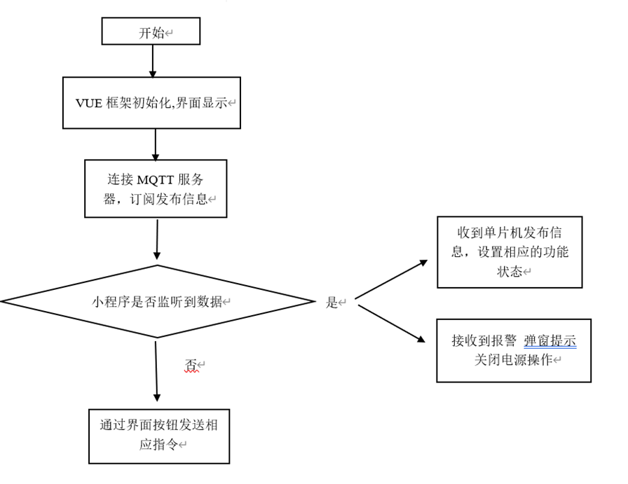
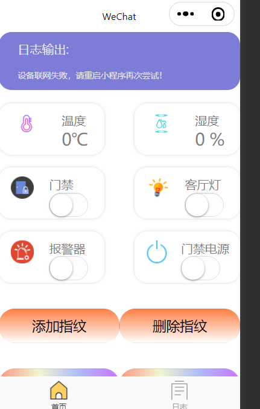
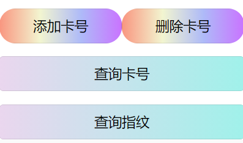

## 视频演示：

【基于stm32智能家居门禁系统小程序开发项目】 https://www.bilibili.com/video/BV1rWhDeEEaJ/?share_source=copy_web&vd_source=71d9b2e4797a31996f154ced9c82d8df

视频还有添加删除卡号，添加删除指纹，关闭继电器电源等没有演示。


## 总体功能：

本门禁系统主要解锁功能分别为卡片解锁，指纹解锁，小程序远程开锁，云端和本地端的结合，使我们解锁更加便捷，快速。在硬件上主要采用的是：底层板子运用嘉立创打印的板子，焊接上stm32f103最小系统板，0.96寸的OLED，RC522的RIFD射频感应模块，舵机模块，继电器、蜂鸣器等模块。

在软件上，利用通信协议实现各个模块和stm32f103之间的通信，实现数据的交互功能。最后通过代码烧录进入单片机，实现项目设计完整的功能。

## 系统程序流程图：






本次的设计思路小程序是根据上一篇智能家居小程序来设计的。在原本进行优化设计更多的功能。


## 硬件部分：





继电器和温湿度是后边接的，使用杜邦线引就可以了。

项目的模块都在原理图上边了。

## stm32部分：

代码工程文件太多，代码工程将会更新到GitHub


### 系统流程设计

本次系统流程设计首先从开机对时钟初始化、GPIO初始化、ADC初始化、PWM初始化等。接着将各个模块的引脚进行相应模式的初始化，如OLED显示屏，蜂鸣器模块，LED灯模块，按键，RC522模块，WIFI模块，指纹识别模块等。接着编写主程序逻辑，设计好逻辑通过判断那个模块触发执行相应的门禁解锁功能,同时也需要对门禁实现安全防护，使用蜂鸣器报警提示。


### 核心主程序设计

主函数：首先进行各模块的引脚初始化 

```c
	u8 ensure;
	unsigned char *dataPtr = NULL;
	OLED_Init();
	Servo_Init();
	Key_Init();
	LED_Init();
	BEEP_Init();
	NVIC_PriorityGroupConfig(NVIC_PriorityGroup_2); //设置NVIC中断分组2:2位抢占优先级，2位响应优先级
	USART1_Init(115200);

	RC522_IO_Init();
	PcdReset();  //复位RC522
	PcdAntennaOff();  //关闭天线
	delay_ms(100);
	PcdAntennaOn();  //开启天线
```

接着在main函数中写while循环，首先先判断是否为解锁状态，如果是已解锁状态，程序标志lock将设置为1，通过判断lock为1，再循环判断按键的状态，来实现菜单的切换，来实现开锁后管理员的功能，例如添加卡号，删除卡号，关闭门禁等等

```c
	while (1)
	{
	
		if(lock)//开锁状态
		{
		KeyNum = Key_GetNum();
		if (KeyNum == 1)
		{

			LED1_Turn();

			OLED_Clear();
			if(Line <= 5)
			{
				Line = 8;
			}else{
				Line --;
			}
			main_interface();	//解锁后的主界面			
		}else if(KeyNum == 2)
		{
			LED1_Turn();
			OLED_Clear();
			if(Line >= 8)
			{
				Line = 5;
			}else{
				Line ++;
			}
			main_interface();	//解锁后的主界面		
		}else if(KeyNum == 3) //确认按键
		{

			if(Line == 6) //添加指纹
			{

				Add_FR(++fingerprints_num);				
			}
			
			if(Line == 7) //删除指纹
			{

				Del_FR(fingerprints_num);											
			}

			if(Line == 8)
			{
				OLED_Clear();
			
				lock = 0;
								
			}
		}			
					
				
		}else{//关锁状态
			OLED_WriteCN(16,1,0,6);    //显示->智能门禁系统
			OLED_WriteCN(56,4,1,1);		 //显示锁
			OLED_ShowString(8,7,"Back"); 
				
			RC522_Get_card();//检测到有刷卡 启动识别验证开锁
			Check_FR(); //检测到有指纹 启动识别验证开锁			
					
		}
		
		dataPtr = ESP8266_GetIPD(3);
		if(dataPtr != NULL)
			OneNet_RevPro(dataPtr);
		delay_ms(10);

		
	}
```

本次系统主程序流程设计首先将各个模块的引脚进行相应模式的初始化，如OLED显示屏，蜂鸣器模块，LED灯模块，按键，RC522模块，WIFI模块，指纹识别模块等。接着编写主程序逻辑，在while循环中，首先判断门禁lock标志位，如果是0即OLED显示锁屏状态，指纹模块，刷卡模块进行识别工作，通过wifi模块连接MQTT服务器，将门禁的状态、LED状态、蜂鸣器状态、继电器状态、温湿度等数据进行上报给服务器，识别过程出现失败，失败次数num+1，当达到5次即触发报警功能，当解锁成功时，将lock标志位置1，OLED显示解锁后的状态，云端小程序收到报警提示。接着设计好系统整体逻辑细节，具体实现流程如下图所示：



图4-14 系统主程序流程图

 

在主函数main中进行整个系统代码设计，大体可以分为以下的步骤：初始化MCU、系统时钟、MQTT客户端、RFID读卡器和LCD显示屏。已经封装好了相应的模块初始化函数，在主函数直接调用。

 

```c
Init_ALL();//所有模块设备初始化
```

 

（1） 连接WIFI并且订阅接入MQTT服务器。

 

```c
	ESP8266_Init();					//初始化ESP8266	

	while(OneNet_DevLink()){//接入OneNET
				delay_ms(500);
	}	
```

（2）在循环中判断锁门标志lock标志，显示对应的门禁状态。如果门禁lock标志为0（锁门状态），在循环中等待RFID读卡器读卡并获取卡号、指纹触摸识别。识别成功将lock标志置1，并且解锁门禁，OLED显示解锁后界面


（3）在循环中不断发送数据给MQTT服务器，接收相应的指令操作，实现数据同步。

```c
		//数据回发给小程序

		if(timeCount % 60 == 0)//1500ms / 25 = 60  1.5秒执行一次
		{

			if(upload_card_number_flag)
			{
				upload_card_number(); //回发存储的卡号数据给小程序
				upload_card_number_flag = 0;
			
			}else if(upload_fin_number_flag)
			{
			
				upload_fin_number();//回发指纹个数数据给小程序
				upload_fin_number_flag = 0;
				
			
			}else{
			
			/********** 读取LED0的状态 **************/
			Led_Status = GPIO_ReadInputDataBit(GPIOA,GPIO_Pin_12);
				/********** 温湿度传感器获取数据**************/
			DHT11_Read_Data(&humidityH,&humidityL,&temperatureH,&temperatureL);
			DEBUG_LOG(" | 湿度：%d.%d C | 温度：%d.%d %%  ",humidityH,humidityL,temperatureH,temperatureL);
			
			DEBUG_LOG("==================================================================================");
			DEBUG_LOG("发布数据 ----- OneNet_Publish");
			sprintf(PUB_BUF,"{\"Hum\":%d.%d,\"Temp\":%d.%d,\"Door\":%d,\"Led\":%d,\"Beep\":%d,\"Power\":%d}",
				humidityH,humidityL,temperatureH,temperatureL,lock,Led_Status?0:1,Beep_Status,Power_Status);
			OneNet_Publish(devPubTopic, PUB_BUF);
			DEBUG_LOG("==================================================================================");
			ESP8266_Clear();			
			
			}
									
		}
```

（4）处理MQTT服务器推送的消息。通过接收平台返回的数据，进JSON数据解析，判断相应的指令，控制单片机的状态（门禁、报警功能、客厅灯、门禁电源、查询卡号、查询指纹等状态）。延时以降低CPU占用率。

 

```c
		dataPtr = ESP8266_GetIPD(3); //获取平台返回的数据
		if(dataPtr != NULL)
			OneNet_RevPro(dataPtr);//平台返回数据检测
		delay_ms(10);
		timeCount++;
```

最后附一个主函数：

```C
int main(void)
{
	unsigned char *dataPtr = NULL;//接收云平台的数据
	unsigned short timeCount = 0;	//发送间隔变量
	Init_ALL();//所有模块设备初始化

	while (1)
	{

		//数据回发给小程序

		if(timeCount % 60 == 0)//1500ms / 25 = 60  1.5秒执行一次
		{

			if(upload_card_number_flag)
			{
				upload_card_number(); //回发存储的卡号数据给小程序
				upload_card_number_flag = 0;
			
			}else if(upload_fin_number_flag)
			{
			
				upload_fin_number();//回发指纹个数数据给小程序
				upload_fin_number_flag = 0;
				
			
			}else{
			
			/********** 读取LED0的状态 **************/
			Led_Status = GPIO_ReadInputDataBit(GPIOA,GPIO_Pin_12);
				/********** 温湿度传感器获取数据**************/
			DHT11_Read_Data(&humidityH,&humidityL,&temperatureH,&temperatureL);
			DEBUG_LOG(" | 湿度：%d.%d C | 温度：%d.%d %%  ",humidityH,humidityL,temperatureH,temperatureL);
			
			DEBUG_LOG("==================================================================================");
			DEBUG_LOG("发布数据 ----- OneNet_Publish");
			sprintf(PUB_BUF,"{\"Hum\":%d.%d,\"Temp\":%d.%d,\"Door\":%d,\"Led\":%d,\"Beep\":%d,\"Power\":%d}",
				humidityH,humidityL,temperatureH,temperatureL,lock,Led_Status?0:1,Beep_Status,Power_Status);
			OneNet_Publish(devPubTopic, PUB_BUF);
			DEBUG_LOG("==================================================================================");
			ESP8266_Clear();			
			
			}
									
		}	
		
		if(lock)//开锁状态
		{
			KeyNum = Key_GetNum();//扫描按键
			
		if (KeyNum == 1)
		{
			
			OLED_Clear();
			if(Line <= 5)
			{
				Line = 8;
				interface_logo = 1;
				
			}else{
				Line --;
			}
			if(interface_logo == 1)
			{
					main_interface();	//解锁后的主界面	第一页
			
			}else{
					main1_interface();	//解锁后的主界面	第二页
			}
			
		}else if(KeyNum == 2)
		{
			
			OLED_Clear();
			if(Line >= 8)
			{
				Line = 5;
				interface_logo = 2;
			}else{
				Line ++;
			}
			
			
			if(interface_logo == 1)
			{
					main_interface();	//解锁后的主界面	第一页
			
			}else{
					main1_interface();	//解锁后的主界面	第二页
			}
		}else if(KeyNum == 3) //确认按键
		{
			
			if(interface_logo == 1) //界面第一页的选择确认
			{
				if(Line == 5) //灯光变换
				{
								
					LED1_Turn();
		
				}			

				if(Line == 6) //添加指纹
				{
									
					Add_FR(ValidN++);
				
		
				}				
				
							
				if(Line == 7) //删除指纹
				{
					Del_FR(--ValidN);
						
													
				}

				if(Line == 8)
				{
					close_door();
					OLED_Clear();
					lock = 0;
					continue;
									
				}	

					main_interface();
			
			
			}else if(interface_logo == 2)
			{//第二页选择确认
				if(Line == 5) //增加卡号
				{
								
					RC522_Add_card();
		
				}			

				if(Line == 6) //删除卡号
				{
					
				
					RC522_Rm_card();
		
				}				
				
							
				if(Line == 7) //打开警报
				{

					if(Beep_Status == 1)
					{
						Beep_Status = 0;
					}else{
					
						Beep_Status = 1;
					}
													
				}

				if(Line == 8) //开关电源
				{
					if (GPIO_ReadOutputDataBit(GPIOA, GPIO_Pin_8) == 0)
					{
						GPIO_SetBits(GPIOA, GPIO_Pin_8);
						Power_Status = 1;
					}
					else
					{
						GPIO_ResetBits(GPIOA, GPIO_Pin_8);
							Power_Status = 0;
					}
									
				}	
					main1_interface();		//解锁后的主界面	第二页		
			
			
			}
		
		}			
					
				
		}
		else
		{//关锁状态
			OLED_WriteCN(16,1,0,6);    //显示->智能门禁系统
			OLED_WriteCN(56,4,1,1);		 //显示锁

			sprintf(oledBuf,"T:%d.%d  H:%d.%d%%",temperatureH,temperatureL,humidityH,humidityL);
			OLED_ShowString(8,1,oledBuf);//8*16 “ABC”			
			RC522_Get_card();//检测到有刷卡 启动识别验证开锁
			Check_FR(); //检测到有指纹 启动识别验证开锁			
					
		}
		
		if(Fail_Num >=5) //门禁识别错误次数达到5次
		{
			Beep_Status= 1;	
			DEBUG_LOG("发布数据 --Warning--- OneNet_Publish");

			OneNet_Publish(devPubTopic, "{\"Warning\":1}");
			DEBUG_LOG("==================================================================================");

			ESP8266_Clear();
			Fail_Num = 0;
		}
	
		
		dataPtr = ESP8266_GetIPD(3); //获取平台返回的数据
		if(dataPtr != NULL)
			OneNet_RevPro(dataPtr);//平台返回数据检测
		delay_ms(10);
		timeCount++;
	
	}
}
```


###  RFID卡片

模块初始化：

```c
void RC522_IO_Init(void) 
{
	GPIO_InitTypeDef GPIO_InitStruct;
	RCC_APB2PeriphClockCmd(RCC_APB2Periph_GPIOB,ENABLE);
	RCC_APB2PeriphClockCmd(RCC_APB2Periph_AFIO, ENABLE);   //开启AFIO时钟
	GPIO_PinRemapConfig(GPIO_Remap_SWJ_JTAGDisable,ENABLE); //关闭JTAG因为要使用PB3和4
	
	//GPIO_InitStruct.GPIO_Pin = GPIO_Pin_11 | GPIO_Pin_4;
	GPIO_InitStruct.GPIO_Pin = GPIO_Pin_0;
	GPIO_InitStruct.GPIO_Mode = GPIO_Mode_Out_PP;
	GPIO_Init(GPIOB, &GPIO_InitStruct);	
	
	SPI_Configuration(SPI1); 
}

```

通过卡片识别认证来辨别否为正确的卡号：

```c
uint8_t card_number_certification(uint8_t *value)
{
	uint8_t i ,flag=0;
	uint8_t ave;
	int num=0;
	for(i=0;i<4;i++)
	{
		DEBUG_LOG("card_id=%d\t",value[i]);
		num+=value[i]*(i+1);
	}
	DEBUG_LOG("num=%d\r\n",num);
	ave=num/4;
	DEBUG_LOG("ave=%d\r\n",ave);
	switch(ave)
	{
		case 99:flag=1;break;
		case 248:flag=2;break;
		case 249:flag=3;break;
		case 244:flag=4;break;
		case 98:flag=5;break;
		case 39:flag=6;break;

		default :flag=0;Err_Count++;
		
	}
	if(Err_Count==5)
	{
		Run_flag=0;
		Lock_flag=1;
	}
	return flag;
}
```


### AS608指纹

模块初始化：

```c
	USART3_Init(57600);	/*初始化串口3,用于与指纹模块通讯*/
	PS_StaGPIO_Init();					/*初始化FR读状态引脚*/


	while(PS_HandShake(&AS608Addr))			/*与AS608模块握手*/
	{
		delay_ms(400);
		DEBUG_LOG("未检测到模块\r\n");
		delay_ms(1000);
		DEBUG_LOG("尝试重新连接模块\r\n"); 
	}
	DEBUG_LOG("与指纹模块握手成功！r\n");
	DEBUG_LOG("通讯成功\r\n");
	DEBUG_LOG("波特率:%d   地址:%x\r\n",57600,AS608Addr);		/*打印信息*/
	ensure=PS_ValidTempleteNum(&ValidN);										/*读库指纹个数*/
	if(ensure!=0x00)
		ShowErrMessage(ensure);								/*显示确认码错误信息*/
	ensure=PS_ReadSysPara(&AS608Para);  		/*读参数 */
	if(ensure==0x00)
	{
		DEBUG_LOG("库容量:%d     对比等级: %d",AS608Para.PS_max-ValidN,AS608Para.PS_level);
	}
	else
		ShowErrMessage(ensure);		
```

指纹识别详细过程：

```c
void Check_FR(void) //检测到有指纹 启动识别验证开锁
{
	if(PS_Sta)	 //检测PS_Sta状态，如果有手指按下
	{	
			OLED_Clear();
			OLED_WriteCN(6,2,4,5);	
			delay_ms(500);
			OLED_ShowChar(6,12,'.');
			delay_ms(500);
			OLED_ShowChar(6,13,'.');
			delay_ms(500);
			OLED_ShowChar(6,14,'.');
			delay_ms(500);
			OLED_ShowChar(6,15,'.');
			while(1)
			{
					SearchResult seach;
					u8 ensure;
					ensure=PS_GetImage();
					if(ensure==0x00)//获取图像成功 
					{	

								ensure=PS_GenChar(CharBuffer1);
								if(ensure==0x00) //生成特征成功
								{		
											ensure=PS_HighSpeedSearch(CharBuffer1,0,AS608Para.PS_max,&seach);
											if(ensure==0x00)//搜索成功
											{	
														
														unlock_interface();
											
														break;
											}
											else 
														ShowErrMessage(ensure);					
								}
								else
											ShowErrMessage(ensure);

					}

			}
			//delay_ms(100);	
}
}
```


### ESP-8266

1. 导入ESP8266库：将ESP8266库的头文件和源文件导入到Keil5的工程中，以便进行编程和调试。可以将ESP8266的源代码拷贝到Keil5工程中，也可以使用库文件的形式导入，具体的操作方式可以参考相关文档。
2. 连接Wi-Fi网络：使用ESP8266的API函数和库连接Wi-Fi网络，需要指定网络名称和密码等参数。例如，使用Keil5和ESP8266库可以使用如下代码：

模块初始化：

```c
void ESP8266_Init(void)
{
	ESP8266_Clear();
	
	DEBUG_LOG("0. AT - 测试MCU-8266通讯");

	
	while(ESP8266_SendCmd("AT\r\n", "OK"))
		delay_ms(500);	
	DEBUG_LOG("1. AT+RST - 软复位8266");
	ESP8266_SendCmd("AT+RST\r\n", "");
		delay_ms(500);
	ESP8266_SendCmd("AT+CIPCLOSE\r\n", "");
		delay_ms(500);
	DEBUG_LOG("2. AT+CWMODE=1,1 - 设置8266工作模式为STA");
	while(ESP8266_SendCmd("AT+CWMODE=1\r\n", "OK"))
		delay_ms(500);
	
	DEBUG_LOG("3. AT+CWDHCP=1,1 - 使能STA模式下DHCP");
	while(ESP8266_SendCmd("AT+CWDHCP=1,1\r\n", "OK"))
		delay_ms(500);
	
	DEBUG_LOG("4. AT+CWJAP - 连接WIFI");
	while(ESP8266_SendCmd(ESP8266_WIFI_INFO, "GOT IP"))
		delay_ms(500);
	
	DEBUG_LOG("5. AT+CIPSTART - 连接服务器");
	while(ESP8266_SendCmd(ESP8266_ONENET_INFO, "CONNECT"))
		delay_ms(500);
	ESP8266_INIT_OK = 1;
	DEBUG_LOG("6. ESP8266 Init OK - ESP8266初始化成功");
	DEBUG_LOG("ESP8266初始化			[OK]");
	}
```

### SG90舵机

首先通过TIM4定时器和PWM信号控制PB6引脚输出PWM信号，然后通过SG90_SetAngle函数来控制舵机的角度，该函数根据角度计算PWM脉宽，并通过TIM_SetCompare1函数设置PWM脉宽，从而控制舵机转动。最后在main函数中循环控制舵机转到0度、90度和180度。需要注意的是，舵机的PWM周期为20ms，脉宽范围为1000us到2000us，对应舵机转动角度为0度到180度。

```c
#include "stm32f10x.h"
#define SG90_PERIOD 20000 // PWM周期为20ms，即50Hz
#define SG90_MIN 1000 // 舵机最小PWM脉宽
#define SG90_MAX 2000 // 舵机最大PWM脉宽
void SG90_Init(void)
{
    GPIO_InitTypeDef GPIO_InitStruct;
    TIM_TimeBaseInitTypeDef TIM_InitStruct;
    TIM_OCInitTypeDef TIM_OC_InitStruct;
    // 使能GPIOB和TIM4时钟
    RCC_APB2PeriphClockCmd(RCC_APB2Periph_GPIOB, ENABLE);
    RCC_APB1PeriphClockCmd(RCC_APB1Periph_TIM4, ENABLE);
    // 配置PB6引脚为复用功能并设置推挽输出
    GPIO_InitStruct.GPIO_Pin = GPIO_Pin_6;
    GPIO_InitStruct.GPIO_Mode = GPIO_Mode_AF_PP;
    GPIO_InitStruct.GPIO_Speed = GPIO_Speed_50MHz;
    GPIO_Init(GPIOB, &GPIO_InitStruct);
    // TIM4时间基准配置，设定计数器周期为20000，即20ms，时钟预分频系数为72-1
    TIM_InitStruct.TIM_Period = SG90_PERIOD - 1;
    TIM_InitStruct.TIM_Prescaler = 72 - 1;
    TIM_InitStruct.TIM_ClockDivision = 0;
    TIM_InitStruct.TIM_CounterMode = TIM_CounterMode_Up;
    TIM_TimeBaseInit(TIM4, &TIM_InitStruct);
    // TIM4 PWM输出配置，设置OC1模式为PWM模式1，使能预装载寄存器，输出比较值为0
    TIM_OC_InitStruct.TIM_OCMode = TIM_OCMode_PWM1;
    TIM_OC_InitStruct.TIM_OutputState = TIM_OutputState_Enable;
    TIM_OC_InitStruct.TIM_Pulse = 0;
    TIM_OC_InitStruct.TIM_OCPolarity = TIM_OCPolarity_High;
    TIM_OC1Init(TIM4, &TIM_OC_InitStruct);
    // 启动TIM4计数器
    TIM_Cmd(TIM4, ENABLE);
}
void SG90_SetAngle(int angle)
{
    int pulse = 0;
    if (angle < 0) angle = 0;
    if (angle > 180) angle = 180;
    pulse = SG90_MIN + (SG90_MAX - SG90_MIN) * angle / 180;
    TIM_SetCompare1(TIM4, pulse);
}
int main(void)
{
    SG90_Init();
    while (1)
    {
        SG90_SetAngle(0); // 舵机转到0度
        Delay(1000); // 延时1s
        SG90_SetAngle(90); // 舵机转到90度
        Delay(1000); // 延时1s
        SG90_SetAngle(180); // 舵机转到180度
        Delay(1000); // 延时1s
    }
}
```


### oled：

字摸软件设置：




### DHT11:

~~~c

```
#include "dht11.h"
#include "delay.h"


//复位DHT11
void DHT11_Rst(void)	   
{                 
	DHT11_IO_OUT(); 	//SET OUTPUT
    GPIO_ResetBits(GPIOB,GPIO_Pin_1);//拉低DQ
    delay_ms(20);    	//拉低至少18ms
	GPIO_SetBits(GPIOB,GPIO_Pin_1);
	delay_us(30);     	//主机拉高20~40us
}

//等待DHT11的回应
//返回1:未检测到DHT11的存在
//返回0:存在
u8 DHT11_Check(void) 	   
{   
	u8 retry=0;
	DHT11_IO_IN();//SET INPUT	 
    while (DHT11_DQ_IN&&retry<100)//DHT11会拉低40~80us
	{
		retry++;
		delay_us(1);
	};	 
	if(retry>=100)return 1;
	else retry=0;
    while (!DHT11_DQ_IN&&retry<100)//DHT11拉低后会再次拉高40~80us
	{
		retry++;
		delay_us(1);
	};
	if(retry>=100)return 1;	    
	return 0;
}

//从DHT11读取一个位
//返回值：1/0
u8 DHT11_Read_Bit(void) 			 
{
	
 	u8 retry=0;
	while(DHT11_DQ_IN&&retry<100)//等待变为低电平
	{
		retry++;
		delay_us(1);
	}
	retry=0;
	while(!DHT11_DQ_IN&&retry<100)//等待变高电平
	{
		retry++;
		delay_us(1);
	}
	delay_us(40);//等待40us
	if(DHT11_DQ_IN)return 1;
	else return 0;		   
}

//从DHT11读取一个字节
//返回值：读到的数据
u8 DHT11_Read_Byte(void)    
{        
    u8 i,dat;
    dat=0;
	for (i=0;i<8;i++) 
	{
   		dat<<=1; 
	    dat|=DHT11_Read_Bit();
    }						    
    return dat;
}

//从DHT11读取一次数据
//temp:温度值(范围:0~50°)
//humi:湿度值(范围:20%~90%)
//返回值：0,正常;1,读取失败

u8 DHT11_Read_Data(u8 *humiH,u8 *humiL,u8 *tempH,u8 *tempL)    
{        
 	u8 buf[5];
	u8 i;
	DHT11_Rst();
	if(DHT11_Check()==0)
	{
		for(i=0;i<5;i++)//读取40位数据
		{
			buf[i]=DHT11_Read_Byte();
		}
		if((buf[0]+buf[1]+buf[2]+buf[3])==buf[4])
		{
			*humiH=buf[0];			//坑啊原子哥，说明书明明是湿度在前温度在后
			*humiL=buf[1];			
			*tempH=buf[2];
			*tempL=buf[3];
				
		}
	}else return 1;
	return 0;	    
}


//初始化DHT11的IO口 DQ 同时检测DHT11的存在
//返回1:不存在
//返回0:存在    	 
u8 DHT11_Init(void)
{	 
 	GPIO_InitTypeDef  GPIO_InitStructure;
 	
 	RCC_APB2PeriphClockCmd(RCC_APB2Periph_GPIOB, ENABLE);	 //使能PA端口时钟
	
 	GPIO_InitStructure.GPIO_Pin = GPIO_Pin_1;				 //PA0端口配置
 	GPIO_InitStructure.GPIO_Mode = GPIO_Mode_Out_PP; 		 //推挽输出
 	GPIO_InitStructure.GPIO_Speed = GPIO_Speed_50MHz;
 	GPIO_Init(GPIOB, &GPIO_InitStructure);				 //初始化IO口
 	GPIO_SetBits(GPIOB,GPIO_Pin_1);						 //PA0 输出高
			    
	DHT11_Rst();  //复位DHT11
	return DHT11_Check();//等待DHT11的回应
} 


添加指纹成功显示


```

```
#ifndef __DHT11_H
#define __DHT11_H	 
#include "stm32f10x.h"

//IO方向设置
#define DHT11_IO_IN()  {GPIOB->CRH&=0XFFFFFF0F;GPIOB->CRH|=8<<4;}
#define DHT11_IO_OUT() {GPIOB->CRH&=0XFFFFFF0F;GPIOB->CRH|=3<<4;}
////IO操作函数											   
#define	DHT11_DQ_OUT GPIO_SetBits(GPIOB,GPIO_Pin_1) //数据端口	PA0出方向 
#define	DHT11_DQ_IN  GPIO_ReadInputDataBit(GPIOB,GPIO_Pin_1) //数据端口	PA0入方向


u8 DHT11_Init(void);//初始化DHT11
u8 DHT11_Read_Data(u8 *humiH,u8 *humiL,u8 *tempH,u8 *tempL);//读取温湿度
u8 DHT11_Read_Byte(void);//读出一个字节
u8 DHT11_Read_Bit(void);//读出一个位
u8 DHT11_Check(void);//检测是否存在DHT11
void DHT11_Rst(void);//复位DHT11  
		 				    
#endif

```


~~~


### FLASH数据存储：

```c
#include "stm32f10x.h"
#define EEPROM_START_ADDRESS ((uint32_t)0x0800F800) //EEPROM起始地址，选择Flash存储器的最后2个扇区
#define EEPROM_BLOCK_SIZE 4 //块大小，这里设置为4字节
void EEPROM_Write(uint16_t addr, uint32_t data)
{
    uint32_t sector_number = (EEPROM_START_ADDRESS - FLASH_BASE) / FLASH_PAGE_SIZE + (addr / EEPROM_BLOCK_SIZE); //计算扇区号
    uint32_t block_number = (addr % EEPROM_BLOCK_SIZE) / 4; //计算块号
    uint32_t address = EEPROM_START_ADDRESS + (addr & 0xFFFFFC); //计算地址，按照4字节对齐
    FLASH_Unlock(); //解锁Flash存储器
    FLASH_ClearFlag(FLASH_FLAG_EOP | FLASH_FLAG_PGERR | FLASH_FLAG_WRPRTERR); //清除标志位
    FLASH_ErasePage(address); //擦除页面
    if (FLASH_ProgramWord(address + block_number * 4, data) == FLASH_COMPLETE) //写入数据
    {
        FLASH_Lock(); //上锁Flash存储器
    }
}
uint32_t EEPROM_Read(uint16_t addr)
{
    uint32_t address = EEPROM_START_ADDRESS + addr; //计算地址
    return (*(__IO uint32_t*)address); //读取数据
}
```

使用`EEPROM_Write()`函数写入数据，该函数的输入参数为变量的地址和变量的值。首先计算出变量所在的扇区号和块号，然后计算出变量所在的地址，按照4字节对齐。接着解锁Flash存储器，清除标志位，擦除页面，最后使用`FLASH_ProgramWord()`函数将数据写入Flash存储器中，写入操作完成后，上锁Flash存储器。使用`EEPROM_Read()`函数读取数据，该函数的输入参数为变量的地址，计算出变量所在的地址，然后直接读取数据。 需要注意的是，使用Flash存储器模拟EEPROM功能时，需要考虑Flash存储器的寿命和写入次数的限制，以及数据的安全性等问题。如果需要更加安全和可靠的存储解决方案，可以使用外部EEPROM芯片或FRAM芯片。


## wx小程序部分：

```
这一部门设计可以观察我的上一篇文章的智能家居，搭建MQTT服务器-》到代码设计过程都有详细的编写。
```

[【基于stm32f103C8T6-小程序智能家居项目实战-自绘PCB到实现功能一条龙+30分钟解决-各种bug已修复】_harmony 项目 实战-CSDN博客](https://blog.csdn.net/aaa2540567665/article/details/128234123?spm=1001.2014.3001.5502)

**设计思路：**







index.vue

```js
<!--
 * @Author: your name
 * @Date: 2023-04-14 20:16:48
 * @LastEditTime: 2023-04-14 20:16:48
 * @LastEditors: axiong
 * @Description: In User Settings Edit
 * @FilePath: \src\pages\index\index.vue
-->

<template>
  <div class="wrapper">
    <div class="header-wrapper">
      <div class="header-title">
        <span>日志输出:{{ Log }}</span>
        <span></span>
      </div>
      <div class="header-text">
        <span></span>
        <span></span>
      </div>
      <div class="weather-advice">{{ Msg }}</div>
    </div>

    <div class="body-wrapper">
      <div class="data-wrapper">
        <div class="data">
          
          <div class="data-text">
            <div class="data-title">温度</div>
            <div class="data-value">{{ Temp }}℃</div>
          </div>
        </div>
        <div class="data">
          
          <div class="data-text">
            <div class="data-title">湿度</div>
            <div class="data-value">{{ Hum }} %</div>
          </div>
        </div>
      </div>

      <div class="data-wrapper">
        <div class="data">
          
          <div class="data-text">
            <div class="data-title">门禁</div>
            <div class="data-value">
              <switch @change="onDoorChange" :checked="Door" color="#3d7ef9" />
            </div>
          </div>
        </div>
        <div class="data">
          
          <div class="data-text">
            <div class="data-title">客厅灯</div>
            <div class="data-value">
              <switch @change="onLedChange" :checked="Led" color="#3d7ef9" />
            </div>
          </div>
        </div>
      </div>

      <div class="data-wrapper">
        <div class="data">
          
          <div class="data-text">
            <div class="data-title">报警器</div>
            <switch @change="onBeepChange" :checked="Beep" color="#3d7ef9" />
          </div>
        </div>
        <div class="data">
          
          <div class="data-text">
            <div class="data-title">门禁电源</div>
            <switch @change="onPowerChange" :checked="Power" color="#3d7ef9" />
          </div>
        </div>
      </div>

      <div class="data-wrapper">
        <button class="bt_4" hover-class="hover" @click="addfin">
          添加指纹
        </button>

        <button class="bt_4" hover-class="hover" @click="rmfin">
          删除指纹
        </button>
      </div>
      <div class="data-wrapper">
        <button class="bt_6" hover-class="hover" @click="addcard">
          添加卡号
        </button>

        <button class="bt_6" hover-class="hover" @click="rmcard">
          删除卡号
        </button>
      </div>
    </div>
    <div class="body">
      <!-- 弹框内容 -->
      <div class="vueMdelBox">
        <div :hidden="!vueShowModel" class="vueContant">
          <div class="vueTitle">报警提示！</div>
          <div class="vueDetail">触发报警，有人尝试爆破门禁！</div>
          <!-- 确定取消按钮 -->
          <div class="vueBtn">
            <p @click="vueShowModel = false">取消</p>
            <p @click="close_power">关闭电源</p>
          </div>
        </div>
        <!-- 背景黑色蒙版 -->
        <div
          class="vueBgdCol"
          :hidden="!vueShowModel"
          @click="vueShowModel = false"
        ></div>
      </div>

      <button class="bt_2" hover-class="hover" @click="Get_card">
        查询卡号
      </button>
      <div class="vueMdelBox">
        <div :hidden="!vueShowModel1" class="vueContant">
          <div class="vueTitle">卡号查询成功！</div>
          <div class="vueDetail">{{ Card_Msg }}</div>
          <!-- 确定取消按钮 -->
          <div class="vueBtn">
            <p @click="vueShowModel1 = false">取消</p>
            <p @click="confirm">确定</p>
          </div>
        </div>
        <!-- 背景黑色蒙版 -->
        <div
          class="vueBgdCol"
          :hidden="!vueShowModel1"
          @click="vueShowModel1 = false"
        ></div>
      </div>

      <button class="bt_2" hover-class="hover" @click="Get_fin">
        查询指纹
      </button>
      <div class="vueMdelBox">
        <div :hidden="!vueShowModel2" class="vueContant">
          <div class="vueTitle">指纹查询成功！</div>
          <div class="vueDetail">当前指纹存储的数量为：{{ Fin_Msg }}</div>
          <!-- 确定取消按钮 -->
          <div class="vueBtn">
            <p @click="vueShowModel2 = false">取消</p>
            <p @click="confirm">确定</p>
          </div>
        </div>
        <!-- 背景黑色蒙版 -->
        <div
          class="vueBgdCol"
          :hidden="!vueShowModel2"
          @click="vueShowModel2 = false"
        ></div>
      </div>
    </div>
  </div>
</template>

<script>
import { connect } from "mqtt/dist/mqtt.js";

const mqttUrl = "wxs://mqtt.bear321.cn:8084/mqtt";//mqtt 服务器域名/IP
const sub = "/myhome/sub";//  设备订阅topic（小程序发布命令topic）
const pub = "/myhome/pub";//  设备发布topic（小程序订阅数据topic）

export default {
  data() {
    return {
      client: {},
      Temp: 0,
      Hum: 0,
      Light: 0,
      Led: false,
      Beep: false,
      Door: false,
      Power: false,
      Msg: "", //服务器连接状态提示
      Log: "", // 命令下发信息
      Card_Msg: "", //卡号信息
      Fin_Msg: "", //指纹信息
      vueShowModel: false, //默认不显示 警报提示
      vueShowModel1: false, //默认不显示 卡号查询提示
      vueShowModel2: false, //默认不显示 指纹查询显示
    };
  },

  components: {},

  methods: {
    // 点击按钮打开弹框
    Get_card() {
      var that = this;

      this.client.publish(
        sub,
        '{"target":"Get_card","value":1}',
        function (err) {
          if (!err) {
            console.log("成功下发命令---查询卡号");
            that.Log = "成功下发命令---查询卡号";
          }
        }
      );
    },
    Get_fin() {
      var that = this;

      this.client.publish(
        sub,
        '{"target":"Get_fin","value":1}',
        function (err) {
          if (!err) {
            console.log("成功下发命令---查询指纹");
            that.Log = "成功下发命令---查询指纹";
          }
        }
      );
    },
    // 关闭电源
    close_power() {
      var that = this;
      this.vueShowModel = false;
      this.client.publish(sub, '{"target":"Power","value":0}', function (err) {
        if (!err) {
          console.log("成功下发命令---关闭电源");
          that.Log = "成功下发命令---关闭电源";
        }
      });
    },
    // 点击确定按钮模态框消失
    confirm() {
      this.vueShowModel1 = false;
      this.vueShowModel2 = false;
    },
    onDoorChange(event) {
      console.log("666！");
      var that = this;
      console.log(event.mp.detail);
      let sw = event.mp.detail.value;
      that.Door = sw;
      if (sw) {
        that.client.publish(sub, '{"target":"Door","value":1}', function (err) {
          if (!err) {
            console.log("成功下发命令---开门");

            that.Log = "成功下发命令---开门";
          }
        });
      } else {
        that.client.publish(sub, '{"target":"Door","value":0}', function (err) {
          if (!err) {
            console.log("成功下发命令---关门");
            that.Log = "成功下发命令---关门";
          }
        });
      }
    },
    onLedChange(event) {
      var that = this;
      console.log(event.mp.detail);
      let sw = event.mp.detail.value;
      that.Led = sw;
      if (sw) {
        that.client.publish(sub, '{"target":"LED","value":1}', function (err) {
          if (!err) {
            console.log("成功下发命令---开灯");
            that.Log = "成功下发命令---开灯";
          }
        });
      } else {
        that.client.publish(sub, '{"target":"LED","value":0}', function (err) {
          if (!err) {
            console.log("成功下发命令---关灯");
            that.Log = "成功下发命令---关灯";
          }
        });
      }
    },
    onBeepChange(event) {
      var that = this;
      console.log(event.mp.detail);
      let sw = event.mp.detail.value;
      that.Beep = sw;
      if (sw) {
        that.client.publish(sub, '{"target":"BEEP","value":1}', function (err) {
          if (!err) {
            console.log("成功下发命令---打开警报器");
            that.Log = "成功下发命令---打开警报器";
          }
        });
      } else {
        that.client.publish(sub, '{"target":"BEEP","value":0}', function (err) {
          if (!err) {
            console.log("成功下发命令---关闭警报器");
            that.Log = "成功下发命令---关闭警报器";
          }
        });
      }
    },
    addfin(event) {
      var that = this;
      this.client.publish(sub, '{"target":"Addfin","value":1}', function (err) {
        if (!err) {
          console.log("成功下发命令---添加指纹");
          that.Log = "成功下发命令---添加指纹";
        }
      });
    },
    rmfin(event) {
      this.client.publish(sub, '{"target":"Rmfin","value":1}', function (err) {
        if (!err) {
          console.log("成功下发命令---删除指纹");
          that.Log = "成功下发命令---删除指纹";
        }
      });
    },
    addcard(event) {
      var that = this;

      this.client.publish(
        sub,
        '{"target":"Addcard","value":1}',
        function (err) {
          if (!err) {
            console.log("成功下发命令---添加卡号");
            that.Log = "成功下发命令---添加卡号";
          }
        }
      );
    },
    rmcard(event) {
      this.client.publish(sub, '{"target":"Rmcard","value":1}', function (err) {
        if (!err) {
          console.log("成功下发命令---删除卡号");
          that.Log = "成功下发命令---删除卡号";
        }
      });
    },
    onPowerChange(event) {
      var that = this;
      console.log(event.mp.detail);
      let sw = event.mp.detail.value;
      that.Power = sw;
      if (sw) {
        that.client.publish(
          sub,
          '{"target":"Power","value":1}',
          function (err) {
            if (!err) {
              console.log("成功下发命令---打开门禁电源");
              that.Log = "成功下发命令---打开门禁电源";
            }else{

              that.Log = "发送命令失败---请检查网络连接并且重启小程序";
            }
          }
        );
      } else {
        that.client.publish(
          sub,
          '{"target":"Power","value":0}',
          function (err) {
            if (!err) {
              console.log("成功下发命令---关闭门禁电源");
              that.Log = "成功下发命令---关闭门禁电源";
            }else{

              that.Log = "发送命令失败---请检查网络连接并且重启小程序";
            }
          }
        );
      }
    },
  },

  // created () {
  //   // let app = getApp()
  // }
  onShow() {
    var that = this;
    wx.showToast({
      title: "连接服务器....",
      icon: "loading",
      duration: 10000,
      mask: true,
    });
    let second = 10;
    var toastTimer = setInterval(() => {
      second--;
      if (second) {
        wx.showToast({
          title: `连接服务器...${second}`,
          icon: "loading",
          duration: 1000,
          mask: true,
        });
      } else {
        clearInterval(toastTimer);
        wx.showToast({
          title: "连接失败",
          icon: "error",
          mask: true,
        },
            that.Msg = "设备联网失败，请重启小程序再次尝试！"
        );
      }
    }, 1000);
    that.client = connect(mqttUrl);
    that.client.on("connect", function () {
      console.log("成功连接mqtt服务器！");
      clearInterval(toastTimer);
      wx.showToast({
        title: "连接成功",
        icon: "success",
        mask: true,
      });
       // 一秒后订阅主题
      setTimeout(() => {
        that.client.subscribe(pub, function (err) {
          if (!err) {
            console.log("成功订阅设备上行数据Topic!");
            that.Msg = "设备联网成功，正常运行！";
            wx.showToast({
              title: "订阅成功",
              icon: "success",
              mask: true,
            });
          }else{

            that.Msg = "设备联网失败，订阅设备上行数据失败";

          }
        });
      }, 1000);       
   
    });
    that.client.on("message", function (topic, message) {
      // console.log(message);
      let dataFromDev = {};
      dataFromDev = JSON.parse(message);
      console.log(dataFromDev);
      that.Temp = dataFromDev.Temp;
      that.Hum = dataFromDev.Hum;
      that.Light = dataFromDev.Light;
      that.Led = dataFromDev.Led;
      that.Beep = dataFromDev.Beep;
      that.Door = dataFromDev.Door;
      that.Power = dataFromDev.Power;
      if (dataFromDev.Warning == 1) {
        that.vueShowModel = true;
      }
      if (dataFromDev.value == 1) {
        that.Card_Msg = dataFromDev.Card_Msg;

        that.vueShowModel1 = true;
      }
      //console.log(dataFromDev.Fin_Msg);
      if (dataFromDev.Fin_Msg >= 0) {
        that.Fin_Msg = dataFromDev.Fin_Msg;
        that.vueShowModel2 = true;
      }
    });
  },
};
</script>


<style lang="scss" scoped>
/* 从左往右渐变 */
.bt_2 {
  margin-top: 40rpx;
  background: linear-gradient(to right, #ead6ee, #a0f1ea);
}

/* 从上往下渐变 */
.bt_1 {
  margin-top: 40rpx;
  background: linear-gradient(#ccfbff, #ef96c5);
}

/* 半透明渐变 */
.bt_4 {
  margin-top: 40rpx;
  background: linear-gradient(rgb(252, 126, 67), rgba(255, 0, 0, 0));
  width: 80%;
  border-radius: 50rpx;
  /* background: bg_red; */
}
/* border-radius: 98rpx;是控制按钮边变圆 */
.goodbutton {
  margin-top: 30px;
  width: 80%;
  background-color: rgb(252, 126, 67);
  color: white;
  border-radius: 98rpx;
  background: bg_red;
}

/* 按下变颜色 */
.hover {
  top: 3rpx;
  background: rgb(236, 179, 156);
}

/* 多色渐变 */
.bt_6 {
  margin-top: 40rpx;
  background: linear-gradient(to right, #f9957f, #f2f5d0, #aebaf8, #c973ff);
  width: 80%;
  border-radius: 50rpx;
}
.vueBgdCol {
  position: fixed;
  top: 0;
  left: 0;
  width: 100%;
  height: 100%;
  background-color: black;
  z-index: 99;
  -moz-opacity: 0.6;
  opacity: 0.6;
  filter: alpha(opacity=88);
}

.vueContant {
  padding: 10px 0px 0px 0px;
  position: fixed;
  top: 36%;
  left: 50%;
  width: 80%;
  margin-left: -40%;
  background-color: white;
  z-index: 100;
  overflow: auto;
  border-radius: 10px;
}

.vueTitle {
  display: flex;
  justify-content: center;
  font-weight: bold;
}

.vueDetail {
  font-size: 14px;
  color: #646566;
  display: flex;
  justify-content: center;
  padding: 16px;
}

.vueBtn {
  display: flex;
}

.vueBtn p {
  width: 50%;
  padding: 5% 0%;
  font-weight: bold;
  text-align: center;
  border-top: 1px solid #ebedf0;
}

.vueBtn p:last-child {
  color: #ee0a24;
  border-left: 1px solid #ebedf0;
}

.header-wrapper {
  padding: 15px;
  background-color: #7d7dd7; //背景颜色
  border-radius: 20px; //圆角
  color: rgba(242, 246, 242, 0.867);
  box-shadow: #7d7d 0px 0px 0px;
  padding: 15px 30px; //文字上下边距
  .header-title {
    display: flex;
    justify-content: space-between;
  }
  .header-text {
    font-size: 32px;
    font-weight: 400;
    display: flex;
    justify-content: space-between;
  }
  .weather-advice {
    margin-top: 20px; //间距
    font-size: 14px;
  }
}
.data-wrapper {
  margin-top: 20px;
  display: flex;
  justify-content: space-between;
  .data {
    background-color: #fff;
    width: 150px;
    height: 80px;
    border-radius: 20px;
    display: flex;
    justify-content: space-around;
    padding: 0 8px;
    box-shadow: #d6d6d6;
    box-shadow: #d6d6d6 0px 0px 5px;
    .data-logo {
      height: 36px;
      width: 36px;
      margin-top: 15px;
    }
    .data-text {
      margin-top: 15px;
      color: #7f7f7f;
      .data-value {
        font-size: 26px;
      }
    }
  }
}
.button-sp-area {
  margin: 0 auto;
}
</style>

```


## 功能整改：

```
1.实现卡号添加删除 存入stm32 ==》完成

2.蜂鸣器 可以更换语音播报 或者添加语音播报
3.加个温湿度传感器 在锁屏主界面显示  ==》完成 
4.小程序添加注册功能 能够查询出入门禁时间 什么方式

查询出入 最后一次出入的时间 方式 显示在小程序顶端

5.报警功能 门禁识别连续3次失败    蜂鸣器（灯）报警 （完成）
温度若大于37.3 也报警 
6.与小程序交互 ////（完成大部分 目前存在数据有时不是很快的对应，小程序发送有时会卡死 ）

添加freetos 
7.删除指定的指纹-----

```


## 项目总结：


项目难点：

```
1.移植模块之间会出现有一些不匹配，或者通信不上，这里可能要检查好是否硬件问题，软件问题就要查询相应的代码是否漏下什么。
2.小程序和stm32之间通过wifi再链接到mqtt服务器通信也是一个难点需要打通。
3.逻辑bug，出现过一些数据上传失败或者下发失败，上位机或者下位机没收到数据问题。
```

个人总结：

```
通过这个项目，让我感受到嵌入式软件开发的流程，从最开始硬件制作，到完成软件端的开发，认识到一个产品都是基于一个芯片，然后集成的各种模块，逐步实现其各种功能。学习到stm32的开发应用，模块移植，硬件焊接等知识。最后也是有存在问题待解决（延时处理），可以进一步移植使用FreeRTos系统来解决，完善细节，实现更多功能，投入实际运用
```

